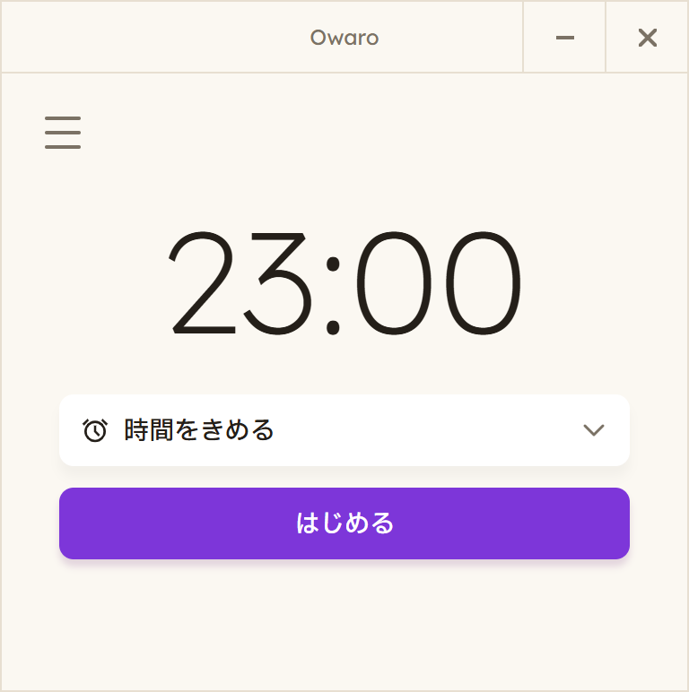
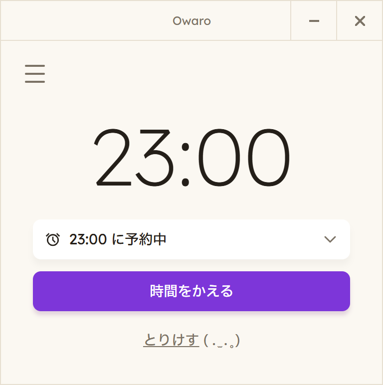
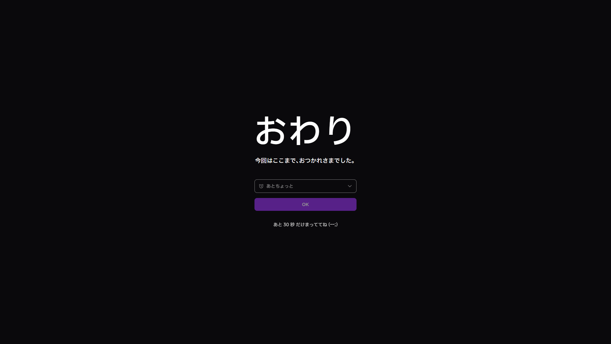

# Owaro（おわろ〜）

**作業を「やめられない」人のための、止まらせるアプリ。**

作業を始めるときに、止め時をひとつ決める。
その時刻になると、全画面が塞がれて曲が流れる。すぐには消せない。
消したら、実際に何時から何時まで作業したかが記録として残る。

Windows 用。

<p>
  
  
</p>


左: 起動画面（大きな時刻が止め時）／右: 予約中（立てて5分以内）／下: 止め時が来たときの全画面（30秒は OK を押せない）

---

## なぜタイマーやアラームではないのか

タイマーもアラームも、**知らせるだけ**で終わる。
知らせを無視するコストがゼロだから、「あと5分」を何回でも押せてしまう。
そして無視した記録は、どこにも残らない。

Owaroは、知らせるのではなく**止める**。違いはこの4つ。

| | 普通のタイマー・アラーム | Owaro |
|---|---|---|
| 止め時が来たら | 通知が出る（画面の隅） | 全画面が塞がる（全モニター・最前面） |
| 消すには | ワンタップ | 30秒待ってからOK |
| 延長は | 無制限・無痕跡 | 1回だけ。5/10/15分から選び、記録に残る |
| 終わったあと | 何も残らない | 実際に作業した時間が記録に残る |

止め時から逃げる道を塞いでいるわけではない。
タスクマネージャで殺せば止められるし、それでいい。
**逃げを防ぐのではなく、逃げを記録に変える**——これがこのアプリの設計思想。

### 続けるのに熱量を要求しない

習慣化アプリの多くは、連続日数やバッジで「続けたくなる気持ち」を作ろうとする。
Owaroはそれをしない。

達成感を出さない。褒めない。連続記録を煽らない。
止め時が来て、淡々と終わる。それだけを目的にしている。

熱量を要求された時点で脱落する人がいる。
「頑張って続けなければいけないこと」になった瞬間に続かなくなる、という感覚を
出発点に設計してある。気づいたら使っている、くらいの温度がちょうどいい。

止め時の音も同じ考え方で選んだ。警報ではなく、区切りを告げる静かなピアノ曲にしてある。

---

## 実際に効いているのか（作者自身の実測）

作者本人の 2026-06-29 から 2026-08-19 までの **23回・合計 21.4時間** の記録。

- **延長ボタンを押した回数: 0 / 23**（当時は延長を何回でも押せた）
- **止め時から OK を押すまでの中央値: 42秒**

OK は最初の30秒は押せないので、押せるようになってから12秒ほどで押している。
止め時が来たら、ほぼその場で区切れている。

**この数字の限界**

- 使ったのは作者1人（N=1）。作者には効いた、という記録で、誰にでも効くとはまだ言えない。
- 数えているのは OK を押して終えた回だけ。この期間は、OK を押さずに終わった回を残す仕組みがまだ無かった。
  この穴を埋めるために、2026-09 に missed.json を足した（下の「OK を押さずに終わった約束」）。
- Owaro を使わなかった日は数に入っていない。

---

## 使い方

### インストール

1. 配布ページ（このリポジトリの Releases）から `Owaro Setup <版>.exe` をダウンロードして実行する
2. 青い画面「Windows によって PC が保護されました」が出たら、「詳細情報」を押し、出てきた「実行」を押す。
   電子署名（有料）を付けていないために出る警告で、Owaro に問題があるという意味ではない
3. 確認なしで `%LOCALAPPDATA%\Programs\Owaro` に入り、デスクトップに「Owaro」ができる
4. インストールが終わっても自動では起動しない。デスクトップの「Owaro」から1回起動する

### 止め時を決めて、はじめる

1. Owaro を開く（デスクトップの「Owaro」、またはタスクトレイのアイコン →「Owaro を開く」）
2. 画面の大きな時刻が止め時。最初は「今から5分後」を5分単位に切り上げた時刻が入っている（8:42 に開けば 8:50）
3. 変えたいときは「時間をきめる」を押し、時と分（5分刻み）のドラムで選ぶ
4. 「はじめる」を押すと窓が閉じる。あとは作業する

窓を閉じても Owaro はタスクトレイに残り、止め時を待っている。
アプリそのものを終えるのは、トレイのアイコン →「アプリを終了」だけ。

### 止め時が来たら

- すべてのモニターが最前面の画面で塞がり、曲が流れる
- 30秒は OK を押せない。OK を押すと画面が閉じて、記録が残る
- まだ終われないときは「あとちょっと」を開いて 5 / 10 / 15分を選ぶ。OK が「あと N 分」に変わり、押すと延長される
- **延長は1回だけ。** 次のおわり画面では「あとちょっと」は出ない。
  まだ続けたいなら、終えてから止め時を決め直す

### 立てた直後の5分間

- **5分以内**: 「時間をかえる」で止め時を変えられる。「とりけす」で取り消せる（取り消しは記録しない）
- **5分を過ぎたら**: 止め時は変えられない。代わりに「いますぐ おわる」が出て、止め時を待たずに
  おわり画面を出せる（おわり画面を通るので記録は残る）

立て間違いは直後に気づくが、逃げたい衝動は締切間際に湧く——この時間差を使って、
訂正だけを拾い、逃げ道にはならないようにしてある。
変えても「始めた時刻」は最初に「はじめる」を押した時刻のまま。変えるたびに猶予が延びることはない。

### 決められない止め時

- **日付をまたぐ止め時。** 「作業しすぎを止めるアプリに、日をまたぐ止め時は存在しない」という判断による。
  境界はカレンダーの日付ではなく翌朝5時（深夜0時半に立てる夜更かし中の利用は塞がない）
- **18時間より先の止め時**

### メニュー（三本線）

| 項目 | 中身 |
|---|---|
| 記録を保存する | 記録をファイルに書き出す（下の「記録の書き出し」） |
| PC起動時に開く | オンにすると、PC にログインしたときに Owaro の窓が開く。最初はオフ |
| おわりに曲を流す | オフにすると、おわり画面が無音になる。最初はオン |
| このアプリについて | アプリの説明と、曲のクレジット |

---

## 記録されるもの

**設定した時刻ではなく、実際の時刻が記録される。**

| 記録される項目 | 中身 |
|---|---|
| 開始 | 最初に「はじめる」を押した実時刻 |
| 止め時 | 自分で決めた時刻 |
| 延長 | 押した時刻と、選んだ分数（最大1回） |
| 終了 | おわり画面の OK を実際に押した実時刻 |

たとえば 8:42 に「はじめる」を押して止め時を 9:30 にし、9:31 に OK を押したなら、
記録は「8:42 開始 / 9:30 止め時 / 9:31 終了」。
**作業時間は 48分ではなく 49分**として残る。
設定値ではなく実測値なので、あとから「本当はどれだけやっていたか」が復元できる。

記録は `%APPDATA%\yakusoku-guard\records.json` に貯まる（フォルダ名は旧名のまま。名前を変えると、それまでの記録を引き継げないため）。
外部に送信しない。アカウントもクラウド同期もない。

### OK を押さずに終わった約束

OK を押さずに終わった約束も、捨てずに同じフォルダの `missed.json` に残る。
作業時間の記録（`records.json`）とは別の帳面なので、作業時間の集計には混ざらない。

| 終わり方 | 記録先 | 書き出しの「種類」 |
|---|---|---|
| おわり画面で OK（「いますぐ おわる」→ OK も同じ） | records.json | おわり |
| 「とりけす」（立てて5分以内） | 記録しない | — |
| 止め時に Owaro が動いていなかった（PC を切った・アプリを終了した。延長したあとを含む） | missed.json | 見逃し |
| おわり画面が出たまま、Owaro が終わった（タスクマネージャで終了など） | missed.json | OKなし |
| おわり画面を全部閉じた（Owaro は動いたまま） | missed.json | OKなし |
| 進行中の約束のメモが壊れていて読めなかった | missed.json | 読めない記録 |

Owaro が動いていなかった回は、次に起動したときに気づいて書き込む。
OK を押していないので終えた時刻は分からない。推測では埋めず、空欄のまま残す。
「読めない記録」も、読めた範囲の時刻だけを残し、読めなかった項目は空欄にする。
メモの中身がまるごと壊れていたときは、そのメモ自体も同じフォルダに `state.json.corrupt-（数字）` という名前で残す（メモ帳で開いて中身を確かめられる。要らなければ消してよい）。

### 記録の書き出し

メニューの「記録を保存する」で、保存画面の「ファイルの種類」から CSV / Markdown / HTML を選んで書き出せる。

入っているのは事実だけ: 日付・種類・開始・止め時・終了・作業していた時間・止め時からの超過・延長の回数と分数。
OK を押した回と押さずに終わった回が、開始時刻の順に1つの表に並ぶ（「種類」の列で見分ける）。
押さずに終わった回は、終了・作業していた時間・超過が空欄になる。
達成率や連続日数は入れていない（上の「熱量を要求しない」の考え方による）。

アプリの中に記録を眺める画面は無い。振り返りは、書き出したファイルを表計算ソフトや AI に読ませて行う想定。

---

## 作らないと決めたもの

このアプリで**あえて作っていない**もの。理由つきで残しておく。

- **強制終了の封鎖** — 防止の軍拡競争はしない。逃げは記録に変える
- **OK を押したあとの強制**（「5分以内にシャットダウン」など） — それをやると常駐の監視ソフトになる
- **何度でもできる延長** — 延長は1回。続けたいなら決め直してもらう
- **ポイント・バッジ・紙吹雪** — 続ける動機を外から与えると、止まる理由が入れ替わる
- **アプリ内の記録画面・達成率・連続日数** — 達成感を作る装置になるため。記録は書き出して読む
- **休憩・一時停止** — 記録しているのは「止め時を決めてから終えるまで」の時間。純粋な作業時間に変えると、測っているものの定義が変わってしまう
- **AIが止め時を提案する機能** — 止め時を決めるのは人間。AIはレビュー役に留める
- **時刻のプリセットボタン** — 朝も夜も使うので、使用時刻が散らばり固定候補が合わない
- **前回の時刻を覚えておく機能** — 決まった時刻に立ち上げる道具ではなく、
  その人が立ち上げた時刻を起点にする道具だから

---

## 技術構成

- **Electron + electron-vite + React + TypeScript**。配布用のインストーラは electron-builder（NSIS）で作る
- ブラウザではなく Electron を選んだ理由: 全モニターを最前面で覆う、他アプリより前に出る、
  という要件がWebの権限では原理的に満たせないため
- タスクトレイ常駐（同時に1つしか起動しない）＋ モニターごとに1枚ずつ最前面の窓を出して全画面を覆う
- 時刻のドラムは OS 標準部品を使わず自作（Mac/Winで見た目が変わるのを避けるため）
- フォント（IBM Plex Sans JP / Lexend / YakuHanJP）は同梱。オフラインでも字面が変わらない
- 曲はファイル（ogg）を同梱し、Web Audio API でフェードイン・フェードアウトとループをかけて流す

## 開発

```
npm ci             # 依存パッケージを入れる
npm run dev        # 開発用に起動（--watch）
npm run typecheck  # 型チェック
npm run build      # ビルド
npm run dist       # インストーラを作る → dist\Owaro Setup <版>.exe
```

- `npm run dev` は、インストール版と**同じ記録フォルダ**を使う。試しに約束を立てるときは
  `scripts\open-demo.cmd`（記録フォルダを `yakusoku-guard-demo` に分ける）で起動する
- `scripts\open-gallery.cmd` は画面カタログ（全画面の状態を並べた確認用ページ）を開く
- アイコンは `design/icon/app_icon.png`（1024px）から `python scripts/make-icon.py` で `build/icon.ico` を作り直す
- 新しく clone した場合、窓を開く前に `node node_modules/electron/install.js` を1回実行する
  （`npm ci` だけでは Electron 本体が取り寄せられないため。型チェックとビルドには不要）

---

## クレジット

- 曲: 「Hanadoki」（ピアノソロ版） PeriTune（むつき醒 様） / [CC BY 4.0](https://creativecommons.org/licenses/by/4.0/)
  （フェード・ループ処理を加えています） — https://peritune.com/blog/2025/03/03/hanadoki/
- フォント: IBM Plex Sans JP、Lexend、YakuHanJP（いずれも SIL Open Font License 1.1）。ライセンス文は [licenses/](licenses/) にある

---

## ライセンス

Owaro は無料のアプリで、ソースコードも公開している。ただしオープンソースではない。

- 使うのは自由。個人・法人、仕事・私用を問わない
- 再配布、改造したものの配布、販売などの商用利用はできない
- 曲とフォントは、上の「クレジット」のとおり、それぞれのライセンスに従う

詳しくは [LICENSE.md](LICENSE.md)。
